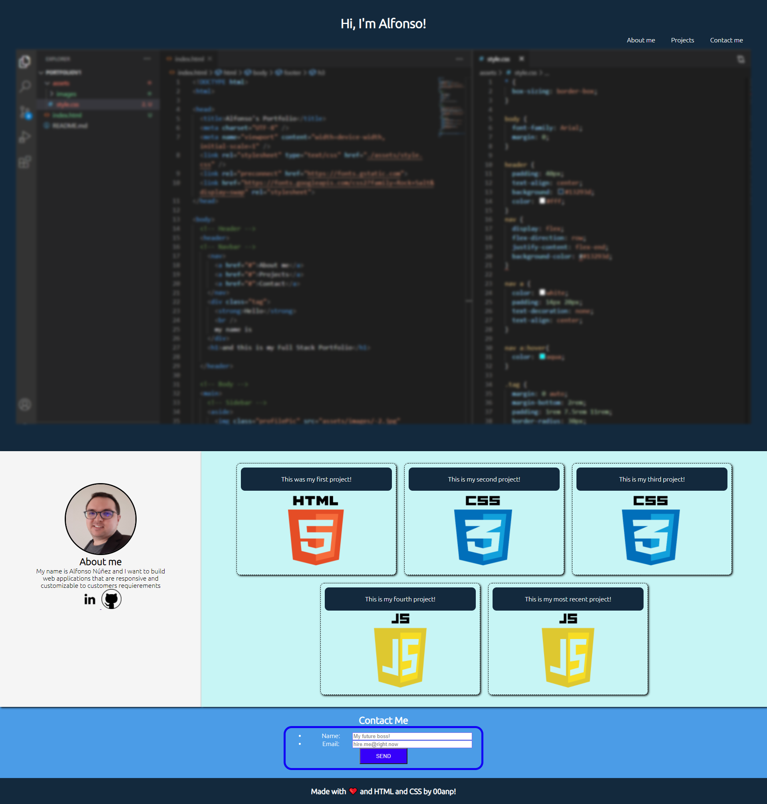

# PortfolioV1
This is the version one of my Portfolio. 

Screen capture of my site

[Link to website](https://00anp.github.io/PortfolioV1/)

Description
The objective was to build a site from scratch using HTML and CSS.This is a good practice on how to put together a website.
It  was challenging dealing with a lot of CSS elements, because I don't consider it a very intuitive language. Having to deal with them individually was difficult when resizing for different screen sizes.

I chose a simple design because I didn't want to do a complex one with out having the basic grid elements and functions figured out. The more elements I was trying to put in the more confused I was with the CSS elements interacting with each other.

Also, for the projects part I put placeholder images from the languages we're learning, because I don't have any projects to show, for now every image in the projects section will link to my Github page.

